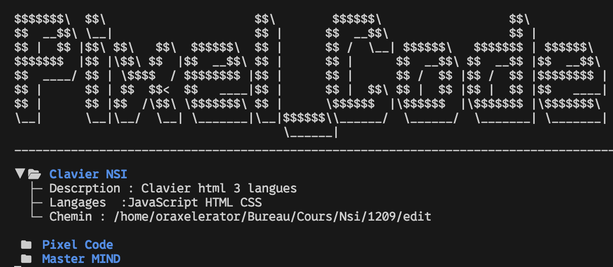

```text
$$$$$$$\  $$\                     $$\        $$$$$$\                  $$\           
$$  __$$\ \__|                    $$ |      $$  __$$\                 $$ |          
$$ |  $$ |$$\ $$\   $$\  $$$$$$\  $$ |      $$ /  \__| $$$$$$\   $$$$$$$ | $$$$$$\  
$$$$$$$  |$$ |\$$\ $$  |$$  __$$\ $$ |      $$ |      $$  __$$\ $$  __$$ |$$  __$$\ 
$$  ____/ $$ | \$$$$  / $$$$$$$$ |$$ |      $$ |      $$ /  $$ |$$ /  $$ |$$$$$$$$ |
$$ |      $$ | $$  $$<  $$   ____|$$ |      $$ |  $$\ $$ |  $$ |$$ |  $$ |$$   ____|
$$ |      $$ |$$  /\$$\ \$$$$$$$\ $$ |      \$$$$$$  |\$$$$$$  |\$$$$$$$ |\$$$$$$$\ 
\__|      \__|\__/  \__| \_______|\__|$$$$$$\\______/  \______/  \_______| \_______|
                                      \______|
```
### 🇫🇷 :
### Qu'est-ce que Pixel_Code ?
Pixel_Code est un outil en Python permettant de facilement enregistrer vos projets en cours, et de les ouvrir facilement depuis le terminal avec une petite interface.



> [!NOTE]
>
> Pixel_Code est une TUI app (Terminal User Interface)

#### Comment ça marche ?

Objectif => faciliter l’ouverture via VS Code et une meilleure organisation et visualisation des projets en cours et finis.

### Instalation sur :
<details>
<summary><strong>1. Ubuntu/Linux</strong></summary>

* Si **pipx n'est pas installé :**
     
    ```bash
    sudo apt install pipx
    pipx ensurepath
    ```
* Téléchargez le projet et installez l’outil :

    ```bash
    git clone https://github.com/OrAxelerator/Pixel_Code.git
    cd Téléchargemts/Pixel_Code
    pipx install .
    ```
</details>

---
<details>
<summary><strong>2. MacOs</strong></summary>


 *  Téléchargez le projet et installez l’outil  :

    ```cmd
    git clone https://github.com/OrAxelerator/Pixel_Code.git
    cd Pixel_Code
    pip install -e .
    ```
    
</details>

---

<details>
<summary><strong>3. Windows</strong></summary>


*  Téléchargez le projet et installez l’outil :
     ```cmd
        git clone https://github.com/OrAxelerator/Pixel_Code.git
        cd ./Downloads/Pixel_Code
        py -m pip install -e .
    ```
    * Si vous recevez l'erreur :
        ```
        Successfully uninstalled pixel-code-0.1.0 WARNING: The script pixel-code.exe is installed in 'C:\Users\User\AppData\Local\Python\pythoncore-3.14-64\Scripts' which is not on PATH. Consider adding this directory to PATH or, if you prefer to suppress this warning, use --no-warn-script-location. Successfully installed pixel-code-0.1.0
        ```
        <details>
        <summary>Faite :</summary>
        
        1. faite : 
        2. Win + R 
        3. dans la popup rentrez : sysdm.cpl
        4. onglet avancé
        5. variables d'environement
        6. Dans Variables utilisateur → sélectionner Path
        7. Modifier
        8. Nouveau
        9. coller ce chemin si (changez avec votre username) : C:\Users\votre username\AppData\Local\Python\pythoncore-3.14-64\Scripts
        10. OK -> OK -> OK
        11. Fermez et re-ouvrez le terminal après ça.
            
        et problème réglez

        </details>

* Ou sinon si vous recevez cette eurreur : 
    ```
    WARNING: The script xxx.exe is installed in 'C:\Users\XXX\AppData\Local\Microsoft\WindowsApps' which is not on PATH
    ```
    C'est que vous avez surement télécharger python depuis le Microsoft store (pas bien)
    allez le télechrgez sur le site officiel : Python.org

    installé pip avrec python : 
    * py -m ensurepip --upgrade
    * py -m pip install --upgrade pip

    </details>

---

> Appelez l'app en tapant la commande : **pixel-code**


> [!IMPORTANT]
>
> Pour que les icônes marchent, il faut mettre la police **"0xProto Nerd Font"** dans votre terminal, et si vous souhaitez exécuter le code dans VS Code, il faut aussi définir **Terminal › Integrated: Font Family** = `"0xProto Nerd Font"`
>
> Lien pour installer la police : https://github.com/ryanoasis/nerd-fonts/releases/download/v3.4.0/0xProto.zip

> [!NOTE]
>
> Raccourcis clavier :
> 
> * **ESPACE** : afficher / désactiver la vue complète sur un projet
> * **q** : arrêter l’exécution du fichier
> * **↑/↓** : navigation
> * **p** : ouvrir les paramètres
> * **r** : recharger l’affichage (marche seulement dans main)
> * **e** : éditer les données d’un projet depuis Pixel_Code (pas encore fonctionnel)
> * **a** : ajoutez un projet
> * **d** : suprimer un projet

---